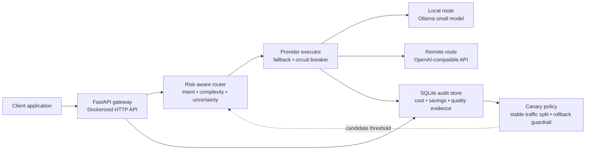

# Model Router

> A Dockerized LLM gateway that routes each request to the lowest-cost model likely to meet its quality bar.

**Built for:** teams that need lower LLM spend without making routing decisions opaque or irreversible.

- Routes simple requests to a local Ollama model and escalates complex or uncertain work to a stronger API model.
- Recovers from provider failures with fallback and per-provider circuit breakers.
- Audits route choice, delivery cost, remote-baseline savings, and independently measured quality deltas.
- Tests new routing thresholds through a deterministic canary with an evidence-based rollback guardrail.

## Architecture



## Why it stands out

Model Router is an operational layer, not a chat wrapper. The decision policy is intentionally interpretable: escalate when estimated quality risk crosses a threshold; otherwise use the local route. Every request exposes the route rationale and records what actually happened.

The design builds on LLM cascade and router research, then adds the deployment controls needed to run such a policy safely:

- [FrugalGPT](https://arxiv.org/abs/2305.05176): cost-efficient LLM cascades.
- [RouteLLM](https://arxiv.org/abs/2406.18665): learned strong-versus-weak model routing.
- [Conformal Risk Control](https://arxiv.org/abs/2208.02814): motivates calibrating the escalation threshold on held-out data.

The research claim is bounded: this implementation provides the data and rollout guardrails needed for calibration, but does not claim a formal risk guarantee until the threshold is calibrated on suitable held-out requests.

## Canary model design

The control policy escalates at a quality-risk threshold of `0.45`. A candidate policy starts at `0.55`, making it deliberately more cost-seeking: requests with estimated risk between `0.45` and `0.55` stay local under the candidate but escalate under control.

1. **Stable exposure:** `CANARY_PERCENT` defaults to `5`; a SHA-256 hash of the request key assigns traffic consistently to control or candidate.
2. **Measured comparison:** paired local/remote evaluations provide the quality labels. The store scores each policy using the answer that route actually served.
3. **Automatic guardrail:** after `CANARY_MIN_EVALUATIONS` (default `20`) candidate evaluations, the candidate stops receiving traffic if its average quality is more than `CANARY_MAX_QUALITY_REGRESSION` (default `0.03`) below control.

This makes a routing-rule change reversible and evidence-driven instead of a global threshold edit.

## Stack

| Layer | Technology | Purpose |
|---|---|---|
| Gateway | Python + FastAPI | Validated HTTP API and route explanations |
| Local inference | Ollama | Low-cost local model for straightforward work |
| Remote inference | OpenAI-compatible API | Higher-capability fallback for difficult work |
| Resilience | Circuit breaker + fallback | Keeps requests flowing through provider failures |
| Evidence | SQLite | Request-level cost, savings, route, and quality records |
| Deployment | Docker Compose | One-command local deployment |

## Evidence and metrics

- `cost_used_usd`: actual executed-provider cost from token counts and configured rates.
- `cost_saved_usd`: remote-model baseline for the same observed token counts minus actual delivery cost.
- `quality_delta_remote_minus_local`: average independently scored paired comparison. Positive means the remote answer scored higher.
- `canary_requests` and `fallbacks`: operational health of routing-policy changes and providers.

Local cost defaults to zero and excludes hardware or energy depreciation. Quality remains `null` until paired answers are evaluated; the router does not pass off a confidence estimate as measured quality.

## Quick start

```sh
cp .env.example .env
# Set REMOTE_API_KEY and your provider contract rates in .env.
docker compose --profile local up --build -d
docker compose exec ollama ollama pull qwen2.5:1.5b
./scripts/demo.sh
```

Set `REMOTE_API_KEY`, `REMOTE_MODEL`, and your provider's current input/output rates in `.env`. `REMOTE_BASE_URL` is OpenAI-compatible, so the stronger model can be any compatible paid API.

## API

- `POST /v1/chat` routes a chat request and returns route evidence and request cost.
- `GET /v1/metrics` returns cost used/saved, fallbacks, canary traffic, and measured quality delta.
- `POST /v1/evaluations/{request_id}` accepts independent `local_score` and `remote_score` values in `[0,1]` for paired evaluation.

For a paired benchmark comparison, send the same prompt twice with `"force_route":"local"` and `"force_route":"remote"`. This is only for collecting evaluation evidence; omit it during normal routing.

Example evaluation after generating both responses for the same prompt:

```sh
curl -X POST http://localhost:8080/v1/evaluations/<request_id-from-chat-response> \
  -H 'content-type: application/json' \
  -d '{"local_score":0.8,"remote_score":0.9}'
```

## Checks

```sh
python3 -m unittest discover -s tests -v
docker build -t modelrouter:check .
```
